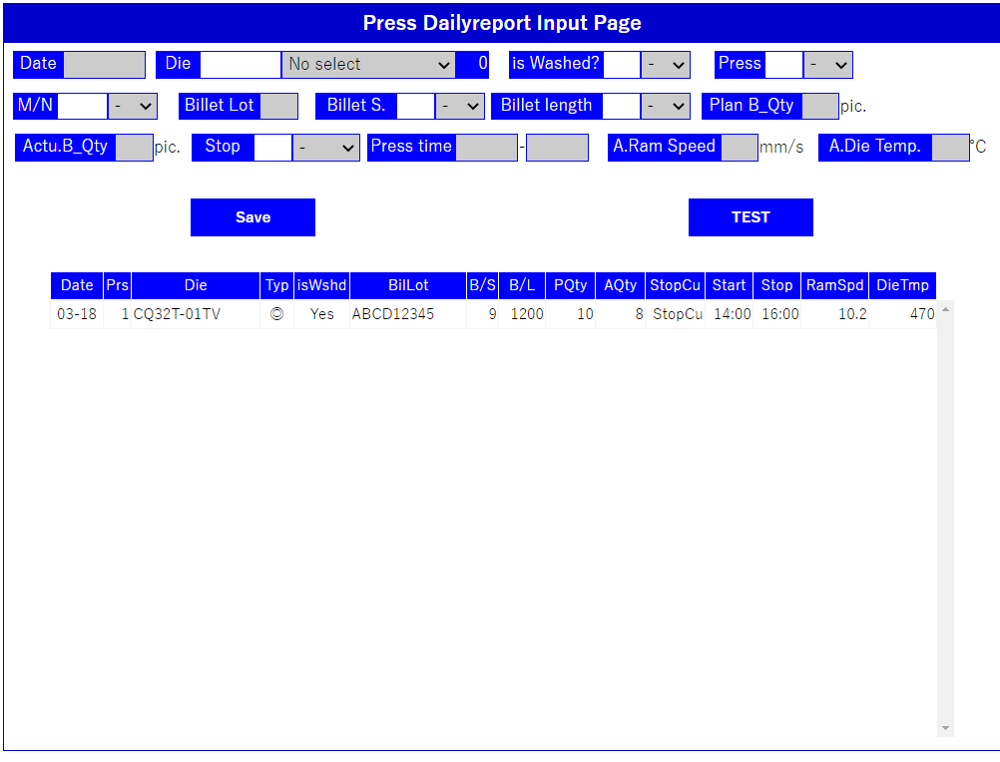
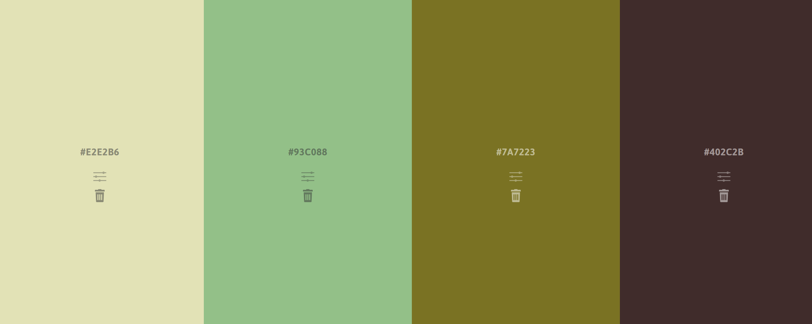

# 20210316

## テーブル作成の基本

カラム名、テーブル名は

* 大文字を使用しない
* 複数単語の連携はスネークケース table_name
* 略名は使用しない 〇start_date　×star_dt
* is_working　などある瞬間の状態を表す名前とする
* 次のカラムは必須 id, created_at, updated_at
* 他テーブルの主キーとジョインするカラムはテーブル名（単数形）_id　cf: category_id
* ×delete_flag　〇is_deleted
* 長くても気にしない
* テーブル名は複数形 ×category 〇categories
* n:nのテーブル　users_categories

当たりか。金型テーブル。

```mysql
CREATE TABLE m_dies (
    id INT NOT NULL AUTO_INCREMENT,
    die_number VARCHARACTER(30) NOT NULL UNIQUE,
    production_number_id INT,
    die_size_id INT,
    billet_size_id INT,
    billet_length int, 
    bolstar_id INT,
    number_of_cabity INT,
    arrival_date_at DATE,
    created_at DATE,
    updated_at DATE,
    PRIMARY KEY (id)
);
CREATE TABLE m_production_numbers (
    id INT NOT NULL AUTO_INCREMENT,
    production_number VARCHARACTER(50) NOT NULL UNIQUE,
    production_category1_id INT,
    production_category2_id INT,
    production_category3_id INT,
    drawn_depertment INT,
    billet_material_id INT,
    aging_type_id INT,
    production_length INT,
    circumscribed_circle INT,
    weight FLOAT,
    packing_quantity INT,
    created_at DATE,
    updated_at DATE,
    PRIMARY KEY (id)
);
CREATE TABLE t_press (
    id INT NOT NULL AUTO_INCREMENT,
    production_directive_id INT,
    dies_id INT,
    press_date_at DATE,
    pressing_type_id INT,
    press_machine_no INT,
    billet_lot_number VARCHAR(20),
    billet_size INT,
    plan_billet_quantities INT,
    actual_billet_quantities INT,
    press_stop_cause_id INT,
    press_start_time_at TIME,
    press_stop_time_at TIME,
    actual_ram_speed float,
    actual_die_temperature int, 
    cooling_type int,
    stretch_date_at date,
    stretch_start_at time,
    stretch_finish_at time,
    cutting_date_at date,
    cutting_start_at time,
    cutting_finish_at time,
    cutting_quantities int,
    PRIMARY KEY (id)
);
CREATE TABLE m_pressing_type (
    id INT NOT NULL AUTO_INCREMENT,
    pressing_type CHAR(5),
    comment_vn VARCHAR(30),
    comment_jp VARCHAR(30),
    PRIMARY KEY (id)
);
CREATE TABLE m_billet_material (
    id INT NOT NULL AUTO_INCREMENT,
    billet_material CHAR(10),
    PRIMARY KEY (id)
);
create table m_aging_type(
    id INT NOT NULL AUTO_INCREMENT,
	aging_type char(10),
    PRIMARY KEY (id)
);
create table m_bolstar(
    id INT NOT NULL AUTO_INCREMENT,
	bolstar_name varchar(30),
    PRIMARY KEY (id)
);
create table m_billet_size(
    id INT NOT NULL AUTO_INCREMENT,
	billet_size int,
    PRIMARY KEY (id)
);
```

次は、外部リンクの作成。下記参考。

```mysql
alter table extrusion.t_press add foreign key (dies_id) references m_dies (id);
alter table extrusion.t_press add foreign key (pressing_type_id) references m_pressing_type (id);
alter table extrusion.m_dies add foreign key (production_number_id) references m_production_numbers (id);
alter table extrusion.m_dies add foreign key (billet_size_id) references m_billet_size (id);
alter table extrusion.m_dies add foreign key (bolstar_id) references m_bolstar (id);
alter table extrusion.m_production_numbers add foreign key (billet_material_id) references m_billet_material (id);
alter table extrusion.m_production_numbers add foreign key (aging_type_id) references m_aging_type (id);
```

表の準備完了。金型データをまず入れる。その前に、品番かな。。。品番データ投入完了。金型データ投入完了。次は、ボルスターかな。。。。ボルスター、入りました。

# 20210318



今、こんな感じ。summary tableの読み出しOK。次は、入力チェック。金型の所は、型名入力枠で、上下ボタンでselectの選択が上下できるといいね。

```javascript
  $('#productnumber__select').prop("selectedIndex", 6);
```

selectIndexプロパティを設定してやると、良いらしい。確かにこれでできるが、フィルターのための文字入力と、かぶってしまうので、よろしくない。

# 20210319

入力チェック。ビレット長さまで完了。

# 20210320

ビレット数の入力で数字のみの入力に出来るか？停止コードテーブル化するか。

```mysql
CREATE TABLE m_press_stop_code (
    id INT NOT NULL AUTO_INCREMENT,
    stop_code INT NOT NULL,
    content_jp VARCHAR(50),
  	content_vn VARCHAR(50),
    PRIMARY KEY (id)
);
```

stopコードの外部読み出しOK。

時間入力。コロンを挿入し、背景色を変更する、事が出来ないか？今は、改行を押したときに、コロンを挿入する。1:00と10:00の区別がつきにくい。100を入力した時にコロンを入れてしまうと、1:00となり、10:00にするには別の処理が必要。なので、1時と2時を諦める。そうすると、1と2から入力されたときは、10:00とか20:00とか4桁入力を待つ。そのほかの数字は3:00とか7:00とかで3桁入力で判断。

1. 一桁目の文字が1or2であるか否か
2. 1or2の時は、4桁入力が終わる？
   1. 後ろから2桁目の前にコロンを挿入する
3. 1or2ではない、3桁入力が終わった？
   1. 後ろから2桁目の前のコロンを挿入する

時刻の判定の課題。何とか解決できたか。

```javascript
function checkTimeValue(inputValue){
  // 0:00 ~ 23:59 までに入っているか否か、判断する
  let flag = false;
  if (inputValue.substr(0, 1) == "1" && inputValue.length == 4){ // 1で始まる4桁時刻
    if ((0 <= Number(inputValue.substr(1, 1)) && Number(inputValue.substr(1, 1)) <= 9) 
      && (0 <= Number(inputValue.substr(2, 2)) && Number(inputValue.substr(2, 2) <= 59))){
      flag = true;
    }else{
      flag = false;
    }
  } else if (inputValue.substr(0, 1) == "2" && inputValue.length == 4) { // 2で始まる4桁時刻
    if ((0 <= Number(inputValue.substr(1, 1)) && Number(inputValue.substr(1, 1)) <= 3)
      && (0 <= Number(inputValue.substr(2, 2)) && Number(inputValue.substr(2, 2) <= 59))) {
      flag = true;
    } else {
      flag = false;
    }
  } else if ((0 <= Number(inputValue.substr(0, 1)) && Number(inputValue.substr(0, 1)) <= 9)
    && inputValue.length == 3){ // 3~9で始まる3桁時刻
    if ( 0 <= Number(inputValue.substr(1, 2)) && Number(inputValue.substr(1, 2) <= 59)) {
      flag = true;
    } else {
      flag = false;
    }
  } else {
    flag = false;
  }
  return flag;
}
```

入力値が時刻であるか否かを判断する。

# 20210322

入力チェックが完了。次は、SAVEボタンを有効化する対策。SAVEボタンの有効化OK。設備停止が、未入力の時、Enterキーで次の入力枠に進む機能が欲しい。OK。

カラーパレット



https://colorhunt.co/

で探すか、、、

# 20210323

停止時の表示がおかしい。修正完了。summaryからの読み出しについて。input要素への代入は簡単だが、select要素はどうするか。。。select手前のinputはやはり簡単。

# 20210326

作業者名を追加する。select要素が0以外を選択しているときは、select要素を読み直さない。